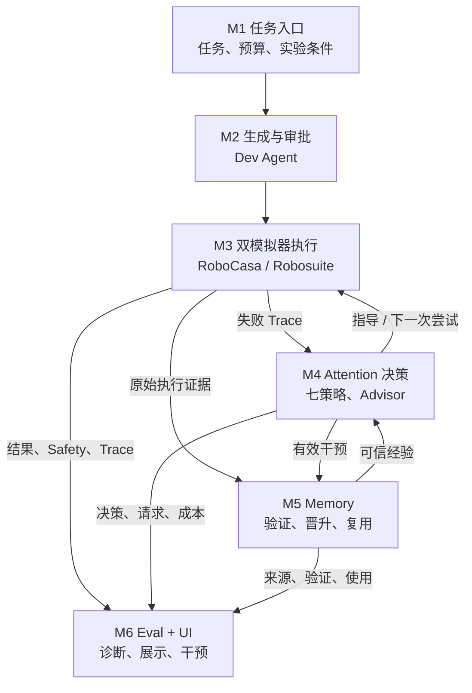
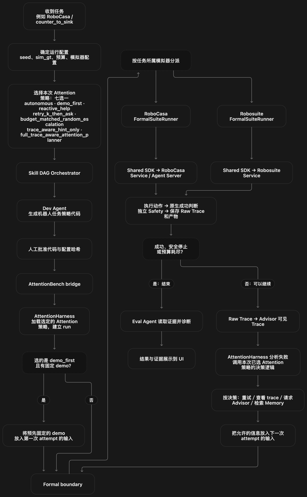
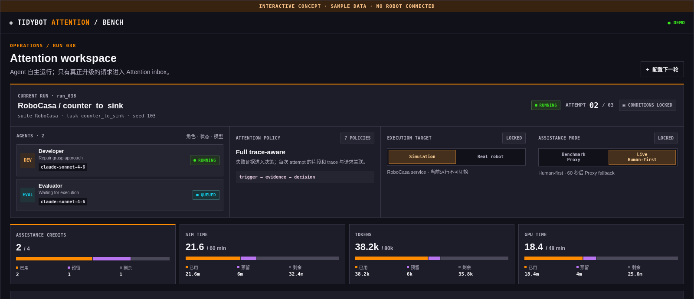

# TidyBot AttentionBench｜第一周进度简报

> **研究目标：**在机器人执行与外部帮助都有成本的条件下，比较不同的求助时机和方式，最终绘制“任务成功率—注意力成本”曲线。**目前系统原型已连通，但尚未产生正式实验数据。**

## 当前系统

M1–M6 及其连接已通过**工程验收**。图中 M6 统一接收执行、求助和 Memory 的证据，并向人展示；它不是另一条独立运行链。

## 对照 proposal 的七项要求

1. **在两种仿真环境中稳定做实验｜还差最后确认。** RoboCasa 和 Robosuite 都能执行任务并保存过程与结果；还需固定用于比较的程序和设置，并确认反复运行足够可靠。
2. **给执行和求助设统一规则｜系统已支持。** 运行时间和求助次数有预算；系统支持先看演示、请求提示、请求批准或紧急停止。预先准备的真人回答及真人测试尚未完成。
3. **比较七种不同的求助方法｜方法已接入，比较尚未做。** 例如“从不求助”“失败后求助”“看过失败记录再决定”。还未让七种方法在同一批任务和预算下完整比较。
4. **失败后判断该重试还是求助｜系统已支持。** 系统能查看失败过程，再决定下一步；目前的自动答复来自固定的模型，不能当作真人回答。
5. **让一次有用的帮助以后还能用｜系统已支持。** 帮助会连同失败证据保存，经过验证后才能在合适的任务中再次使用；长期是否能减少求助还需实验。
6. **让人看见并控制整个过程｜系统已支持。** 界面能显示进度、预算、求助和结果；独立安全监测可停止异常运行。
7. **回答“求助到底值不值”｜尚未完成。** 仍需比较七种方法的任务成功率、求助成本和安全表现，才能得出研究结论。

展开完整系统流程图

*UI 图使用内置样例数据，仅展示界面功能，不代表实验结果。*

## 与原定 Week 1–2 计划相比

| 原本希望做到 | 现在做到哪一步 |
| --- | --- |
| **Week 1：**两种仿真环境能按相同规则反复运行任务 | 两套环境已经能运行并保存结果；还需固定比较时使用的程序和设置，检查多次运行是否可靠。 |
| **Week 2：**失败后能看记录、求助、保存经验，并从界面查看全过程 | 这些步骤已经连成一条可运行的流程，七种求助方法也已接入；这一阶段原本就不要求证明哪种方法最好。 |

**总体判断：**第一周已经把原计划第二周的主要系统功能搭起来；但用于比较的程序、设置和反复运行的可靠性还需确认，所以现在不能报告“哪种求助方法更好”。仿真中暂时直接使用模拟器提供的物体信息，先把研究重点放在求助决策上；真实机器人的视觉识别以后单独验证，两类结果不混在一起。

## 接下来

1. **先保证比较公平可靠：**固定使用的程序和设置，在两种环境中反复试跑，排除会影响结果的系统问题。
2. **再比较七种方法：**让它们完成同样的任务、使用同样的预算，记录成功率、求助次数、用时和安全情况。
3. **最后分析与扩展：**看什么时候求助最值得、已有经验能否减少后续求助，再扩展到真人帮助和新环境。

目前展示的是**系统已经能运行**，不是“哪种方法有效”的论文结论。详细依据见[模块进度](attentionbench_progress.md)与[实验准备审查](attentionbench_formal_admission_audit_2026-09-29.md)。
