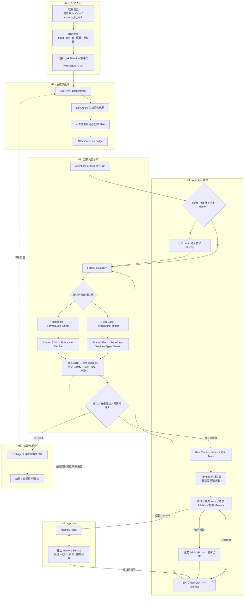

# AttentionBench：按系统模块逐一收口

> 更新：2026-09-28。本页只管**模块顺序和完成关口**；历史工作、命令、版本及原始证据在 [`STATUS.md`](../STATUS.md)。目前所有工程运行仍为 `formal_eligible=false`。

## 工作规则

按图中执行顺序，只开**一个当前模块**：先审计该模块的接口、双模拟器适用范围、代码、失败案例和证据；一次列全已知问题，冻结通过条件；修复、复测直到全部条件通过，再进入下一个模块。包内新缺陷继续修；跨模块问题记到所属模块，若挡住当前验收则停在当前模块；新需求不临时追加。完成只指预先确定的验证级别，不能把小测试说成真实服务或正式实验。若外部条件阻塞，明确停下请求决定，不跳去宣称别的模块已完成。

## 模块顺序与当前关口

| 模块 | 当前关口（未写“完成”的均不可跳过） |
| --- | --- |
| M1 · 任务入口 | **验收完成（仅 M1 工程入口）**：冻结输入／输出契约和拒绝矩阵，双 suite 的 UI／CLI 同条件 lock 与各一次真实 Service 交接已复核；证据见 [`m1_entry_acceptance.md`](m1_entry_acceptance.md)。`formal_eligible=false`。 |
| M2 · 生成与批准 | **封闭工程验收完成（仅 M2）**：双真实 Graph 通过有界 HTTPS `parcc/GLM` 各生成一份公开 SDK 候选和 M1 lock；审批前停在 `awaiting_approval`，用户对上列精确 SHA 明示批准后，两套各经正式 Bridge → Service 完成一次开发 seed 101 handoff。审批后重启均不重派；原生任务均失败，不影响此工程门槛。证据见 [`m2_generation_approval_acceptance.md`](m2_generation_approval_acceptance.md)。`formal_eligible=false`。 |
| M3 · 双模拟器执行 | **修订口径下工程验收完成**：正常执行 12/12、Harness run 4/4、故障路径 7/7、受控 depth 异常隔离 2/2；用户明确批准仅工程层面关闭。原标准的历史 depth 500 根因关口仍未通过、根因未修复；见[原验收](m3_dual_sim_execution_acceptance.md)与[修订验收](m3_dual_sim_execution_revised_acceptance.md)。`formal_eligible=false`。 |
| M4 · Attention 决策 | **封闭工程验收完成（仅 M4）**：[冻结包](m4_attention_decision_acceptance.md)的 A／B／D 双套七策略定向测试 **95 passed**、测试回复闭环各 2 attempts；独立新冻结下，线上 C 的 RoboCasa／Robosuite 各完成 2 次真实正式 Runner attempt、1 次未缓存 GLM 回复并在第二次采用，原始证据与 SHA 审计通过。首轮两次超时原件保留。`formal_eligible=false`。 |
| M5 · Memory | **进行中且阻塞，未关闭**：[冻结包与逐项结论](m5_memory_acceptance.md)。合并 M4 后七项旧回归修复，整合版本 Robosuite 独立正式 run 完成限定检索／v1 授权／使用及范围外与生命周期拒绝；RoboCasa 旧五对仍为 control 0/5、treatment 1/5 且 seed 105 Safety 退步，候选拒绝晋升。尚无另建并预冻结、达到原门槛的新候选，故双套完整关口未通过。`formal_eligible=false`。 |
| M6 · 诊断与展示 | Eval、UI 基本链路已接；**待双 Service 连续 UI 联动与终态／中断时效验收**。真人演练由协作者单列，不暗加进 M6。 |

**M1–M4 已分别按各自工程验收口径关闭；当前只处理 M5，M5 阻塞且 M6 未启动。** M3 的旧 depth 500 未解决风险独立跟踪，工程关闭不等于正式实验准入。完成六模块后另做**全链集成与正式实验准入**；held-out、七策略效果矩阵和消融属于其后的实验，不能倒填成某个工程模块的完成条件。LIBERO／live-human 为协作者扩展，Deploy 在线发现暂缓，均不混入主线六模块。

## 完整流程，直接标出模块边界

这就是[原始完整图](attentionbench-system-flow-reference.png)的同一条运行路径，M1–M6 的分组框直接套在对应节点外；额外把原图缩写成“检索 Memory”的内部过程展开为 M5。`AttentionHarness` 的建 run 属 M3，失败后的策略决策属 M4；UI 的运行前配置属 M1，终态展示属 M6。原 PNG 留档，不再要求两图对照阅读。

维护：开始某模块时记录冻结的验收包和版本；只更新该模块的关口，结果与证据进 `STATUS.md`。不同运行证据各自绑定其当时的仓库提交，不能跨版本混用。此页只在我们实际继续工作时更新，不会后台自动同步。
