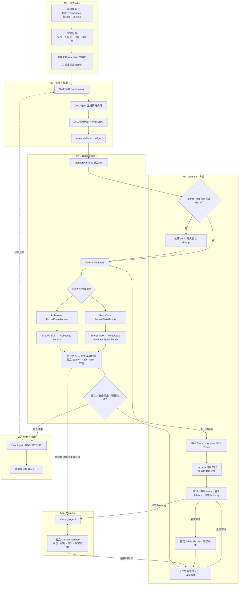

## 2026-09-29（America/New_York）七条件冻结与总体准入审计进行中

范围固定为本开发集主实验（2任务×101–125×7条件×1次），本轮350格仅生成与校验，不执行；held-out、Memory+evidence消融另行冻结。v2.4、attrition_gate与定稿规格书已保存于 `a42ab8201277ffa806281b89a4f14e3ef33b1059`。基础机器人策略字节不改，各条件只改求助规则与获批输入。

chain、50/50 profile、depth operational gate复用，不重跑。独立审计核对787个证据SHA无漂移，并按当前Service评估版本影响。唯一授权的当前RoboCasa未知动作Safety负控在station run/attempt identity预检处失败，未到注入；双Service已回收，保留异常与launcher失败，开发case上限已用尽，不再重跑。因此完整Safety负控尚未通过，总体formal准入仍失败。Memory固定为现有可信v1，仅101/103/105每任务匹配，六个非full条件无Memory；每run独立初始状态/空缓存，禁止自动晋升。正式逐项裁决待独立审计签发。

执行路径已补M1 Memory作用域/版本锁、每run 200 SDK聚合硬限与provider实际token/异常费用记账。Harness全量468 passed、10 skipped；后审修正另做专项验证。证据目录：`/home/truares/桌面/attentionbench-seven-freeze-20260929`。以下保留历史过程与旧范围结论。

# AttentionBench：按系统模块逐一收口

> 更新：2026-09-30。本页只管**模块顺序和完成关口**；历史工作、命令、版本及原始证据在 [`STATUS.md`](../STATUS.md)。目前所有工程运行仍为 `formal_eligible=false`。

<!-- depth-qualifying-current-start -->
## 2026-09-29（America/New_York）depth qualifying 与新版本档案独立验收完成

本轮 depth qualifying 与描述性准入档案完成：Service19fde8a新Robosuite25/25有效（含101–105五例各复用一次）、100尝试、5088持久动作回执；经影响核对的独立RoboCasa25/25有效、70尝试保留。合并50唯一案例、170唯一尝试、680四类产物文件SHA、独立Safety0，原生成功0/50、有效任务失败完整保留。五步骤限定范围均PASS；Robosuite/depth operational_gate=true。工程14网格不升格；c67 Robosuite证据不迁移；原槽30 interrupted_invalid字节及授权补测各自保留。

v2.4已正式写入“当前冻结版本已控制的保留风险”，历史根因unknown；冻结lock旧风险注释由该独立协议裁决明确覆盖，锁本身未改字节。总体准入审计已完成，formal_eligible=false、effect_comparison_authorized=false；未执行held-out或七策略效果矩阵。当前剩余正式范围门的复核见总体审计，未自动启动新轮。

证据：[/home/truares/桌面/attentionbench-depth-qualifying-20260929/CONCLUSIONS.txt](/home/truares/桌面/attentionbench-depth-qualifying-20260929/CONCLUSIONS.txt)，[总体审计](/home/truares/桌面/attentionbench-depth-qualifying-20260929/independent_overall_admission_audit.json) SHA `47832d16fe54a3f6ae50af213daf85923be99526d1d8d04d9a6ca14587addb12`，[协议v2.4](../benchmarks/attention_harness/protocol/v2/formal_admission_v2_4_resolution_2026-09-30.json) SHA `9f060ba02364b537563b11e5dfc2ebbee0cea4150fd9b90ed12886be8065395d`。测试14+34通过。保护33文件、sourcefreeze247文件、RoboCasa历史freeze439文件无变化；所属Service与控制器已回收，在90分钟截止前完成。
<!-- depth-qualifying-current-end -->

<!-- v111-current-start -->
## 2026-09-29（America/New_York）运行管理与 50 槽工程档案完成

50/50 预先指定的整槽结果完整、有效，170 次尝试的四类产物、独立 Safety 0、唯一 Trace、原生布尔值和 Service 回收收据均核对通过。 原生任务成功 0/50；任务失败完整留档，不按成败筛选。完整结果与失败/未运行清单见[独立终审](/home/truares/桌面/attentionbench-fixed-base-profile-20260929/engineering_v112_isolated_continuation/final_audit.json)，SHA `fb8af591345a4f8e5670e925731ee3792ac54d276eb86711d696df8d434efb13`。

前 29 槽明确引用 v110 的 98 次既有尝试，仅计一次；槽 30–36 引用本轮 v111 的 7 个已完成结果；v111 因外部 Service 源改动在派发槽 37 前停止，v112 隔离同一冻结提交，仅继续 37–50，全部结果各计一次。用户本轮授权的槽 30 独立补测及 31–50 均由[运行前冻结计划](/home/truares/桌面/attentionbench-fixed-base-profile-20260929/engineering_v112_isolated_continuation/profile_plan.json)指定唯一目录。原槽 30 中断原件永久保留为 `interrupted_invalid`，不充当完整结果；v110 原计划和账本未改写。全部历史失败、两次 API 兼容测试失败和启动前宿主识别拒绝日志保留；该启动拒绝未派发任何槽。

槽边界停止、持久派发与状态、独立跨宿主退出回收、终结收据及显式恢复已完成，9/9 可控子进程测试通过。[冻结修订](/home/truares/桌面/attentionbench-fixed-base-profile-20260929/engineering_v112_isolated_continuation/freeze.json) SHA `17f3defc57b8539bd9efc66e2bf90d9f006d99c44d30d3ae35f766404bd19ede`；3382 份历史文件、原运行/策略/配置/模拟器/Safety/评测/预算字节及个案审计逻辑均未改变。所有已启动 Service 已回收，控制器已退出。该轮用时约 70.8 分钟，未自动启动下一轮。

范围仅关闭本轮运行管理和执行档案工作。depth 比较偏差关口继续独立跟踪且未通过，`comparison_bias_gate=false`、`formal_eligible=false`；未升级整个模块完成，未开启七策略比较或 held-out。当前版本为 v112，沿用本轮原 90 分钟总截止。检查点见[CHECKPOINT](/home/truares/桌面/attentionbench-fixed-base-profile-20260929/engineering_v112_isolated_continuation/CHECKPOINT.md)与[progress](/home/truares/桌面/attentionbench-fixed-base-profile-20260929/engineering_v112_isolated_continuation/progress.json)。
<!-- v111-current-end -->

## 当前模块裁决：固定条件 RoboCasa／Robosuite（最新）

[v88 六个原阻塞 seed 合并审计](/home/truares/桌面/attentionbench-fixed-base-profile-20260929/engineering_v88_six_blocker_audit/audit.json)确认 110／111／116／117／119／122 在相同候选策略、动作后端与 sim／Agent 源码树下，各有一项定向工程探针完成、独立 Safety 0、产物与回收通过。117／122 的 `_0` 目标名在真实公开 Trace 中被查询；116／119 动作有回执。旧六个无效判定不变，六例也不计新链或新档案。RoboCasa 工程阻塞有了合并证据，depth 偏差与新版本整包审阅仍待解决。

[v87 两个缺口 seed 的最终组合候选审计](/home/truares/桌面/attentionbench-fixed-base-profile-20260929/engineering_v87_final_combined_targets/audit.json)：seed116／117 各一次离档单尝试均完成、原生评估失败、独立 Safety 0，四类产物与服务回收通过。116 首次 4.69 mm 残差修正至 3.32 mm；117 正确查询 `bottled_drink_0`，规划无轨迹时安全结束。旧 50 槽哈希不变；这些工程结果不计新链或新档案，depth 偏差裁决和新版本整包审阅仍是下一关。

[v86 可执行失效关口](/home/truares/桌面/attentionbench-fixed-base-profile-20260929/engineering_v86_attrition_gate/audit.json)已把预定任务×seed×条件网格、每槽唯一、逐次原始文件哈希、独立 Safety、版本身份和未审 depth 恢复的拒绝规则做成只读审计器；另拒绝跨条件复用同一 episode，核对运行／尝试 ID 与 Trace 条件。六项对抗测试通过。旧 50 槽回归检查仍拒绝原有六个无效案例。此关口不证明历史 depth 500 无动作依赖偏差，不能替代新版本完整审阅；`comparison_bias_gate=false`，新五 seed 链、50 槽与七条件比较仍禁启。

[depth 恢复与偏差审计](/home/truares/桌面/attentionbench-fixed-base-profile-20260929/engineering_v85_depth_recovery_bias_audit/audit.json)：候选对动作后越界深度只做一次不推进物理的补采，要求原始两帧、SHA 和仿真状态不变；恢复回执进入正式 Trace。独立负控中两帧持续越界仍为 HTTP 500／Safety unsafe 1，正控中仅首帧越界的案例完成 6 个动作、Safety 0，四类产物与 Service 回收均复核。普通单步无恢复标记。历史异常的原帧缺失，无法判断实际故障是否属于可恢复瞬态；若按有效案例筛选，动作或策略依赖的无效率仍可能造成比较偏差。后续比较必须保留预定全矩阵，任何无效或未审恢复均停在独立偏差审计关口。当前 `comparison_bias_gate=false`，新五 seed 链及 50 槽禁启，`formal_eligible=false`。

此前[可动柜门轨迹审计](/home/truares/桌面/attentionbench-fixed-base-profile-20260929/engineering_v72_door_guard_audit/audit.json)：规划世界保留可动柜门形体，但现有 `strict` ACM 将它们与机器人放宽。候选已增加只读逐点门碰撞检查，并在提交动作前拒绝碰门轨迹。独立工程 seed122、seed110 分别发现 13、17 个碰门轨迹点，均无手臂动作且 Safety 0；seed119 的四次扫描零碰撞、两次动作残差 <4 mm 且 Safety 0；seed111 无规划轨迹、Safety 0。四例原生任务均未成功，安全拒绝不等于任务达成。旧诊断状态及旧哈希配置两版各保留 unsafe 1 原档；旧 50 槽、无效标签、4 mm 容差不变。RoboCasa 原生成功和 Robosuite depth 比较偏差未解决，新链与新档案仍禁启，`formal_eligible=false`。

此前[物理接触审计](/home/truares/桌面/attentionbench-fixed-base-profile-20260929/engineering_v63_physical_contact_audit/audit.json)：离档 seed122 手臂动作开始约 6 秒后，仿真物理接触记录中 `panda_link6` 持续碰到 `hingeleftdoor`，42 个采样的最大冲量约 1.805；该次独立 Safety unsafe 1。这解释了该次关节和底座停滞的重要物理因素，但不能外推到旧四个无效案例。规划器存在起点碰撞后清空障碍世界的回退，铰链门是否被有效纳入轨迹检查仍需核实。候选只增加工程接触记录，旧 50 槽原件、4 mm 容差、Robosuite depth 未解裁决不变；新链和新档案仍禁启，`formal_eligible=false`。

此前[FK 与严格收敛复测](/home/truares/桌面/attentionbench-fixed-base-profile-20260929/engineering_v61_stable_settle_audit/audit.json)：离线[仿真 URDF 核对](/home/truares/桌面/attentionbench-fixed-base-profile-20260929/engineering_v59_sim_fk_diagnostic/audit.json)显示，修正后的首次规划关节目标对应的公开 EEF 位置距任务目标仅约 0.007 mm，实际关节角对应约 8.085 mm 误差。候选去掉二次残差补偿，并要求关节与底座连续三次满足更严稳定阈值；定向测试主链 105 passed、执行器 6 passed。真实 seed122 首次动作仍在 10 秒后以关节 0.0115 rad、底座 28.14 mm 的误差未收敛，独立 Safety unsafe 1 并停跑。规划器曾清空碰撞世界重试，但此前安全完成的 seed119 也有此行为，物理接触原因未确证。旧 50 槽、原 4 mm 容差、Robosuite depth 未解裁决不变；新链与档案仍禁启，`formal_eligible=false`。

新增[关节与底座终点诊断](/home/truares/桌面/attentionbench-fixed-base-profile-20260929/engineering_v58_arm_endpoint_audit/audit.json)：离档 seed122 的首次规划动作虽完成，末端仍差 8.661 mm，最大关节误差 0.01076 rad、底座偏离保持目标 29.61 mm；后续修正关节误差 0.05914 rad，执行器不收敛，独立 Safety unsafe 1。日志补强了定位依据，但尚未确定跨案例的主因；四类产物、源身份和回收已核对。旧 50 槽与冻结 4 mm 容差不变，手臂可靠性和 depth 比较偏差仍阻塞新链与新档案，`formal_eligible=false`。

最新[手臂坐标与残差续查](/home/truares/桌面/attentionbench-fixed-base-profile-20260929/engineering_v56_arm_frame_postmortem/audit.json)发现 RoboCasa 规划器 `ee_link` 与公开 EEF 的固定偏航差 45°；修正规划姿态后，真实 seed122 两次动作的偏航变化均小于 0.5°。但三版独立工程 seed122 的最终残差仍为 8.235／6.322／6.307 mm，均超过原 4 mm 容差，各由独立 Safety 记 unsafe 1 并停跑。底座执行期间的位移仍待定位；小幅修正现有次数和进展停止界限，v55 已因进展不足结束。三版四类 SHA、Service 源身份与回收核对通过，主链定向 105 passed、Agent 轨迹 5 passed。旧 50 槽结果不变，seed110／111 未续跑；RoboCasa 手臂与 Robosuite depth 比较偏差关口仍失败，新五 seed 链和 50 槽不得启动，`formal_eligible=false`。

最新[只读规划与残差独立审计](/home/truares/桌面/attentionbench-fixed-base-profile-20260929/engineering_v52_preflight_and_residual_audit/audit.json)：候选 SDK 可在提交手臂动作前查询规划，独立 Safety 核对查询期间末端未移动。v48 seed 117 和 v51 seed 116 的 `IK_FAIL` 因而不提交动作，均完整原生失败、Safety 0；v50 seed 119 查询与两次规划动作成功，Safety 0。但 v51 seed 122 首次规划动作留下 8.707 mm 残差，二次修正关节不收敛、Safety unsafe 1，故按预注册顺序未启动 seed 110／111。旧 50 槽不替换，原 4 mm 容差未放宽。此前 v45–v47 的沙箱和端口入口失败亦[原样留档](/home/truares/桌面/attentionbench-fixed-base-profile-20260929/engineering_v49_readonly_plan_audit/audit.json)。RoboCasa 安全关口与 Robosuite depth 比较偏差仍失败，`formal_eligible=false`。

此前[离档 v40–v43 独立审计](/home/truares/桌面/attentionbench-fixed-base-profile-20260929/engineering_v44_diagnostic_audit/audit.json)：v40 策略入口静态拒绝，未启动仿真；v41 seed 119 单次工程尝试完成、原生失败、Safety 0，但不证明旧故障根治。v42 seed 117 已从公开 GT 正确锁定 `bottled_drink_0`，手臂规划实际 `IK_FAIL`／Safety unsafe 1；v43 额外底盘前进又超时／Safety unsafe 1，该动作已撤回。Service 候选修正了把“规划器已加载但无轨迹”误报为“不可用”的状态。按硬停规则 seed 122 未启动；旧 50 槽不替换。RoboCasa 手臂关口和 Robosuite depth 比较偏差仍失败，`formal_eligible=false`。

此前 RoboCasa [v39 目标实例与小残差候选审计](/home/truares/桌面/attentionbench-fixed-base-profile-20260929/engineering_v39_target_and_arm_candidate/audit.json)确认任务配置中的目标 `obj` 先于干扰物，公开感知按该顺序把重复类别命名为 `_0`／`_1`；旧 seed 117／122 的公开 Trace 均有两者，候选只选 `_0`，缺失时停下。旧 seed 116 的 7.411 mm 残差发生在笛卡尔修正后，候选改为一次有界实测规划修正，继续严格检查 4 mm；新 WholeBodyError 仅投影有界原因，Safety 仍停跑，专项 14 passed。其后真实 Service 结果以上述 v44 为准；seed 116 仍缺新实测，seed 119 原作业错误细节缺失，历史判定不变。

Robosuite Service 的[depth 诊断候选](/home/truares/桌面/attentionbench-depth-diagnostic-v2-20260929/audit.json)现逐次保存同内容坏帧，并标记异常发生阶段与动作摘要；故障注入和 6 项 Service 测试通过。历史异常帧仍缺，无法从这些检查推出七策略比较不存在选择性无效结果；depth 关口继续失败，独立 Safety 停跑规则未变。

新查明 RoboCasa Service 的公开感知请求原本会额外调用一次 `env.step`，现有**未晋级候选**改用 ManiSkill `get_obs()` 读当前图像。固定离档 seed 9003 的三次感知与一次完整 Runner 工程运行通过，原生任务失败、独立 Safety 0、双 Service 回收；首次探针因误用不存在的 `/health` 而超时，失败原件保留。[逐项审计](/home/truares/桌面/attentionbench-fixed-base-profile-20260929/engineering_v38_integrated_readonly/readonly_perception_analysis.json)。尚不能证明旧六个无效例已解决，depth 比较偏差仍未排除；未启动新档案，`formal_eligible=false`。

50 槽后已做[离档工程阻塞分析](/home/truares/桌面/attentionbench-fixed-base-profile-20260929/engineering_v36_blocker_repair/blocker_analysis.json)：RoboCasa 长水平接近的规划路径候选与目标后缀选择候选完成定向测试和旧 Trace 回放，单次工程 seed 9003 链完整、Safety 0、原生失败。117／122 的 `_0` 对应关系现有上述源码依据，但尚无新真实 Service 验证；seed 116／119 的手臂未知结果和 Robosuite depth 500 的动作相关比较偏差仍未解决。候选未建立新审阅整包，未重启五 seed 链或 50 槽；独立 Safety 停跑规则不变，`formal_eligible=false`。

**未完成，`formal_eligible=false`。** 按[预先冻结的验收条件](/home/truares/桌面/attentionbench-fixed-base-profile-20260929/acceptance_freeze.json)，新版审阅整包的新 101–105 双任务链 10/10 完整、独立 Safety 0；随后同策略、同设置的 101–125 双任务档案 **50/50 槽、162 attempts 全部入账**，无挑选、替换或补跑。任务成功不是门槛：有效的 44 例均原生失败。另 6 个 RoboCasa 槽无效：seed 110／111／116／119 的手臂结果未知并被独立 Safety 判 unsafe，seed 117／122 的公开 GT 实例后缀导致目标名查询失配。[50 槽独立审计](/home/truares/桌面/attentionbench-fixed-base-profile-20260929/engineering_v35_profile/independent_profile_audit.json)和[无效例原件定位](/home/truares/桌面/attentionbench-fixed-base-profile-20260929/engineering_v35_profile/invalid_case_forensics.json)保留逐例结果、无效原因、Safety、Trace、四类 SHA 和 Service 回收。其他策略的原生成功仅作[任务可解性旁证](/home/truares/桌面/attentionbench-fixed-base-profile-20260929/engineering_v35_profile/task_feasibility_audit.json)。历史 depth 500 原始异常帧缺失，此次 5088 个 Robosuite backend step 未复现也不能排除动作相关比较偏差；[独立风险裁决](/home/truares/桌面/attentionbench-fixed-base-profile-20260929/engineering_v35_profile/depth_risk_decision.json)未通过。因此 Safety、案例有效性及 depth 比较偏差关口未满足，**本模块不得标完成**；held-out、七策略效果比较及正式实验准入均未启动。以下各段是旧版本过程记录。

后续根因检查发现旧规划器未随 RoboCasa 场景重置刷新，因此先前“邻域均不可达／须绕行 3 m”的诊断基于旧坐标，不能用于真实场景结论。隔离 Service 与 Agent 执行器候选修正场景缓存、严格轨迹结果和 45 mm 工具坐标差后，工程 seed 9003 的三个位置动作均进入原 4 mm 容差，链路完整、Safety 0、原生任务失败。[全位置移动工程审计](/home/truares/桌面/attentionbench-fixed-base-profile-20260929/engineering_v16_all_planned_replay/audit.json)。这些候选仍需更多工程 seed、并入 Runner、另版整包审阅；正式 v2.7 硬停、50 槽缺口及 depth 500 风险不变，**模块未完成**。

早期工程 seed 9003 只读规划探测的旧坐标结果[原样保留](/home/truares/桌面/attentionbench-fixed-base-profile-20260929/engineering_v10_planner_probe/audit.json)，其解释已由上段重置根因检查修正；不能据此判定真实目标不可达。v2.7 硬停、50 槽未完成及 depth 500 风险结论不变，**模块未完成**。

最新的近水槽释放窗口工程候选通过 7 项离线测试，但真实工程 seed 9003 在更早的手臂下降动作上再次触发 Safety 未知结果；[失败动作审计](/home/truares/桌面/attentionbench-fixed-base-profile-20260929/engineering_v8/pregrasp_descent_stall_audit.json)保存原始状态和 Service 回收。候选未晋级新批准包，v2.7 的五 seed 链硬停不变，模块仍未完成。

**最新关口仍未通过。** 隔离工程候选在 seed 9003 三次固定重复中链路完整、Safety 0，但 v2.6 首例因旧收据绝对路径被 CLI 预检拒绝，未产生任务结果。另建并重新审阅的 v2.7 整包通过双收据及十例静态输入核对；新五 seed 链前 3 例完整，在 RoboCasa seed 102 搬运底盘动作停滞、独立 Safety unsafe 1 时硬停，其余 6 例未启动。[最新 50 槽独立审计](/home/truares/桌面/attentionbench-fixed-base-profile-20260929/engineering_v7/final_independent_audit.json)、[停跑逐例审计](/home/truares/桌面/attentionbench-fixed-base-profile-20260929/engineering_v7/stopped_chain_audit.json)与[失败动作原始索引](/home/truares/桌面/attentionbench-fixed-base-profile-20260929/engineering_v7/seed102_cancelled_base_action/sha256_index.json)已保存。25-seed 全量档案未开始，depth 500 的比较偏差风险仍未排除；模块不得标完成。

**固定条件双模拟器模块最终仍未完成。** 在原验收条件不变的前提下，本轮保留三条分版工程链及每次硬停原件：v2.3 RoboCasa seed 101 底盘未知动作／Safety unsafe 1；v2.4 前七例完整，RoboCasa seed 104 抓取后公开分割空检测导致 Runner 未完成；v2.5 RoboCasa seed 101 水槽释放手臂非收敛／Safety unsafe 1。每次只在新版本整包重新审阅后开启新链，未把旧 seed 101 失败替换为新成绩。最新版本 50 个预定档案槽位仅启动 2，完整 1、无效 1、未启动 48；两任务五 seed 链、25-seed 全量档案和 depth 500 比较偏差关口均未通过。[最终独立审计与逐槽结果](/home/truares/桌面/attentionbench-fixed-base-profile-20260929/final_independent_audit.json)及[627 件哈希索引](/home/truares/桌面/attentionbench-fixed-base-profile-20260929/sha256_index.json)留证。本模块保持**未通过**，`formal_eligible=false`；held-out 和七策略效果比较均未运行。

续查确认 RoboCasa 最新未知动作末端几乎停滞，但无碰撞遥测可证实原因；独立 Safety 判定不变。Robosuite 工程 seed 9001 的另一次 200 动作 depth 探针未复现旧 HTTP 500，不能视作根因修复或比较偏差关口通过。[补充诊断与新增证据索引](/home/truares/桌面/attentionbench-fixed-base-profile-20260929/sha256_index_v2.json)已保存；模块状态不变。

隔离的 RoboCasa 底盘对齐候选通过 3 项单元／故障注入测试，但工程 seed 9001–9005 均未在真实 Service 覆盖抓取后搬运，其中 9003 手臂接近阶段又有 Safety unsafe 1；9006 被工程 seed split 拒绝，没有执行任务。[逐例审计](/home/truares/桌面/attentionbench-fixed-base-profile-20260929/engineering_v4/series_audit.json)保留所有探针及 Service 回收证据。候选没有制成或批准新整包，正式 seed 链未重启；模块仍未完成。

**固定条件双模拟器模块当前未完成。** 本轮先冻结[验收条件](/home/truares/桌面/attentionbench-fixed-base-profile-20260929/acceptance_freeze.json)，核对已批准修订包，并完成定向测试。新链 Robosuite seed 101 原生失败但工程链完整；RoboCasa seed 101 搬运阶段底盘超时且已部分移动，独立 Safety 记 `action_outcome_unknown`／unsafe 1，按预定规则立即硬停。新链 101–105 只启动两例，101–125 的 50 个计划槽位中 48 例未启动；旧 seed 101 失败未覆盖。历史 depth 500 根因及比较偏差风险仍未排除。[独立审计与逐槽台账](/home/truares/桌面/attentionbench-fixed-base-profile-20260929/independent_audit.json)列出证据、哈希与阻塞。此模块保持**未通过**，不得标完成或据此批准正式实验；held-out 和七策略效果比较均未运行。

## 工作规则

按图中执行顺序，只开**一个当前模块**：先审计该模块的接口、双模拟器适用范围、代码、失败案例和证据；一次列全已知问题，冻结通过条件；修复、复测直到全部条件通过，再进入下一个模块。包内新缺陷继续修；跨模块问题记到所属模块，若挡住当前验收则停在当前模块；新需求不临时追加。完成只指预先确定的验证级别，不能把小测试说成真实服务或正式实验。若外部条件阻塞，明确停下请求决定，不跳去宣称别的模块已完成。

## 模块顺序与当前关口

| 模块 | 当前关口（未写“完成”的均不可跳过） |
| --- | --- |
| M1 · 任务入口 | **验收完成（仅 M1 工程入口）**：冻结输入／输出契约和拒绝矩阵，双 suite 的 UI／CLI 同条件 lock 与各一次真实 Service 交接已复核；证据见 [`m1_entry_acceptance.md`](m1_entry_acceptance.md)。`formal_eligible=false`。 |
| M2 · 生成与批准 | **封闭工程验收完成（仅 M2）**：双真实 Graph 通过有界 HTTPS `parcc/GLM` 各生成一份公开 SDK 候选和 M1 lock；审批前停在 `awaiting_approval`，用户对上列精确 SHA 明示批准后，两套各经正式 Bridge → Service 完成一次开发 seed 101 handoff。审批后重启均不重派；原生任务均失败，不影响此工程门槛。证据见 [`m2_generation_approval_acceptance.md`](m2_generation_approval_acceptance.md)。`formal_eligible=false`。 |
| M3 · 双模拟器执行 | **修订口径下工程验收完成**：正常执行 12/12、Harness run 4/4、故障路径 7/7、受控 depth 异常隔离 2/2；用户明确批准仅工程层面关闭。原标准的历史 depth 500 根因关口仍未通过、根因未修复；见[原验收](m3_dual_sim_execution_acceptance.md)与[修订验收](m3_dual_sim_execution_revised_acceptance.md)。`formal_eligible=false`。 |
| M4 · Attention 决策 | **封闭工程验收完成（仅 M4）**：[冻结包](m4_attention_decision_acceptance.md)的 A／B／D 双套七策略定向测试 **95 passed**、测试回复闭环各 2 attempts；独立新冻结下，线上 C 的 RoboCasa／Robosuite 各完成 2 次真实正式 Runner attempt、1 次未缓存 GLM 回复并在第二次采用，原始证据与 SHA 审计通过。首轮两次超时原件保留。`formal_eligible=false`。 |
| M5 · Memory | **修订口径下工程完成**：[原冻结包、修订条款、阶段性失败和最终补验](m5_memory_acceptance.md)。Robosuite 正向：有效配对／Service 晋升，独立正式 run 的限定检索、v1 授权、使用和原生成功。RoboCasa 旧两批失败配对与 Safety 反例保留，旧候选未晋升；随后新 v3 候选在五个开发 seed 的完整配对中 control 0/5、treatment 5/5、Safety 0/10，通过原门槛并由 Service 晋升 trusted v1。配对外独立正式边界工程 run 核对限定检索、精确 v1 grant、Trace 使用、原生成功及范围外／生命周期拒绝；[本轮风险审计](/home/truares/桌面/attentionbench-depth-memory-risk-20260929/risk_status.md)。既有 Dev Graph 派发与重启复用结论不变。`formal_eligible=false`。 |
| M6 · 诊断与展示 | **封闭工程验收完成（仅 M6）**：[冻结包、阶段失败及 v4 最终复核](m6_eval_ui_acceptance.md)。双套正式 Runner 产物经 Eval 验身份、SHA、原生结果、独立 Safety 和 Service 回收；真实 `parcc/GLM` 诊断引用同 attempt／事件。UI 展示持久预算、请求、公开 RGB、Trace、诊断和原生结果，UI／Graph 重启可恢复；双套真实 Service 的运行中中断分别在 2.53／0.20 秒确认并回收。故障矩阵及未授权原始证据拒绝通过。历史失败收据保留，`formal_eligible=false`。 |

**M1–M6 已分别按各自工程验收口径关闭；完成六模块不等于全链正式实验准入。** M5 修订工程基线为 `bd8146e`；其旧 RoboCasa 失败配对和未晋升结论保持，新 v3 正向工程验证见上表。M3 的旧 depth 500 根因风险独立跟踪。M6 只关闭 Eval 诊断与 UI 展示／操作工程链路；历史失败与修复复验均见[验收包](m6_eval_ui_acceptance.md)。正式实验准入、held-out、七策略效果矩阵和消融属于后续阶段，不能倒填成某个工程模块的完成条件。LIBERO／live-human 为协作者扩展，Deploy 在线发现暂缓，均不混入主线六模块。

### M1–M6 跨模块工程链路（2026-09-29）

**v7 同版工程验收通过，58/58 项。** [冻结、真实 Graph 与选定双模拟器 run 的证据](m1_m6_cross_module_v7_acceptance.md)覆盖 Dev 来源与用户 SHA 批准、Bridge、正式 Runner、`full_trace_aware_attention_planner`、真实 Advisor、限定 trusted Memory v1、Eval／UI、独立 Safety、原生结果、四类产物、Service 回收及重启去重。Robosuite 候选 A 首次成功而未触发 Advisor／Memory，失败／未覆盖审计单独保留；冻结额度内经另一次精确批准的候选 B 独立 run 完成该链。**该 v7 快照**的 RoboCasa run 未重跑、当时未晋升的候选仍不授权；后续 v3 正向工程验证是独立证据，不倒填 v7。此结论仅为工程验收；`formal_eligible=false`，M3 历史 depth 500 根因风险继续单列，正式效果研究仍未执行。

### 当前关口：正式实验准入（审计未通过）

这是六模块及跨模块工程验收之后的**独立关口**，不是 M1–M6 的返工。[风险记录](/home/truares/桌面/attentionbench-depth-memory-risk-20260929/risk_status.md)已复核提交；[原 v2 冻结协议](../benchmarks/attention_harness/protocol/v2/formal_admission_freeze_2026-09-29.json)保留，[v2.1 修订协议](../benchmarks/attention_harness/protocol/v2/formal_admission_v2_1_2026-09-29.json)与[变更记录](attentionbench_formal_admission_change_log_2026-09-29.md)明确本轮主实验的范围和门槛。[逐项审计](attentionbench_formal_admission_audit_2026-09-29.md)当前裁决仍为**未通过**，`formal_eligible=false`。

| 准入项 | 当前事实与下一步 |
| --- | --- |
| 完整链与策略档案 | **未通过、已硬停**：两主线任务的基础策略及 101–105 精确配置／M1 锁索引获批；预算边界另版修订经 91 项定向小测试及精确批准，仅授权开发链。十例预冻计划中只运行两任务的 seed 101 各一次：Robosuite 原生失败且策略进度自检抛错，调度器判 incomplete；RoboCasa 原生失败且独立 Safety 记 `action_outcome_unknown`／unsafe 1，遂立即停跑。两套 seed 102–105 共八例均未启动，无重跑或按结果改策略。[全局停跑审计及逐文件 SHA](/home/truares/桌面/attentionbench-five-seed-chain-20260929/hard_stop_audit.json)保留原件。各任务 101–125 描述性档案仍缺；没有 held-out、七策略比较，`formal_eligible=false`。 |
| RoboCasa Memory | 新 v3 候选五对 control 0/5、treatment 5/5，Safety 0/10，Service 晋升 trusted v1；配对外独立工程 run 验证精确授权、使用及原生成功。旧失败候选与 Safety 反例保留。此项已有**开发工程证据**，不是 held-out 效果。 |
| Robosuite depth 500 | **未通过**：十个开发 case／60 次动作未复现，历史坏帧缺失，根因仍未知。停跑、记 unsafe、配对无效和留证不能排除动作相关的选择性缺失，故本次不准入；未复现不等于已修复。 |
| 任务范围与资格 | **范围已明确，资格仍阻塞**：v2.1 对本轮主实验明确取代旧 `perception.json` 的 RoboCasa 双任务 25/25 条款；只含 Robosuite `cube_lift` 和 RoboCasa `counter_to_sink`。`counter_to_cab` 实现与历史证据保留，不作本轮准入或七策略矩阵任务。策略证据及 depth 500 仍未过，七策略正式矩阵、消融和 held-out 均未启动，`formal_eligible=false`。 |

本关口协议和审计均已留档；新增的两例开发链运行已按未知动作硬停，未进入正式效果矩阵。准入失败不改变 M1–M6 已通过的工程结论。

**硬停后的新修订（仅工程授权）：** [双任务 101–105 新整包](../benchmarks/attention_harness/protocol/v2/review_packages/formal_repair_2026-09-29/REVIEW.md)已按用户“自动帮我审批通过”的指示，对精确 SHA 索引授予新五 seed 工程链授权；旧两例失败和 v2.1／v2.2 原件仍保留，不能倒填。两任务当前修订各有一次 seed 9001 安全完成但原生失败的工程 smoke；RoboCasa 较早修订的另一次 smoke 出现 `action_outcome_unknown`，已硬停并留证。因此新链仍须在首个 unknown／unsafe 时停止，不能据一次 smoke 宣称安全根因解决。当前新链 101–105 尚未运行，25 seed、held-out、七策略矩阵与正式准入均未启动，`formal_eligible=false`。

## 完整流程，直接标出模块边界

这就是[原始完整图](attentionbench-system-flow-reference.png)的同一条运行路径，M1–M6 的分组框直接套在对应节点外；额外把原图缩写成“检索 Memory”的内部过程展开为 M5。`AttentionHarness` 的建 run 属 M3，失败后的策略决策属 M4；UI 的运行前配置属 M1，终态展示属 M6。原 PNG 留档，不再要求两图对照阅读。

维护：开始某模块时记录冻结的验收包和版本；只更新该模块的关口，结果与证据进 `STATUS.md`。不同运行证据各自绑定其当时的仓库提交，不能跨版本混用。此页只在我们实际继续工作时更新，不会后台自动同步。
