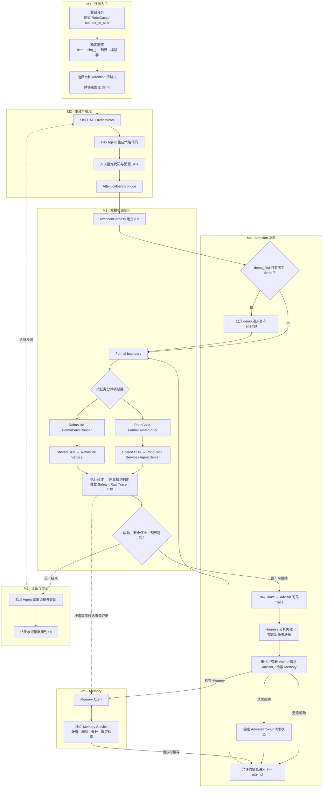

# AttentionBench：按系统模块逐一收口

> 更新：2026-09-29。本页只管**模块顺序和完成关口**；历史工作、命令、版本及原始证据在 [`STATUS.md`](../STATUS.md)。目前所有工程运行仍为 `formal_eligible=false`。

## 工作规则

按图中执行顺序，只开**一个当前模块**：先审计该模块的接口、双模拟器适用范围、代码、失败案例和证据；一次列全已知问题，冻结通过条件；修复、复测直到全部条件通过，再进入下一个模块。包内新缺陷继续修；跨模块问题记到所属模块，若挡住当前验收则停在当前模块；新需求不临时追加。完成只指预先确定的验证级别，不能把小测试说成真实服务或正式实验。若外部条件阻塞，明确停下请求决定，不跳去宣称别的模块已完成。

## 模块顺序与当前关口

| 模块 | 当前关口（未写“完成”的均不可跳过） |
| --- | --- |
| M1 · 任务入口 | **验收完成（仅 M1 工程入口）**：冻结输入／输出契约和拒绝矩阵，双 suite 的 UI／CLI 同条件 lock 与各一次真实 Service 交接已复核；证据见 [`m1_entry_acceptance.md`](m1_entry_acceptance.md)。`formal_eligible=false`。 |
| M2 · 生成与批准 | **封闭工程验收完成（仅 M2）**：双真实 Graph 通过有界 HTTPS `parcc/GLM` 各生成一份公开 SDK 候选和 M1 lock；审批前停在 `awaiting_approval`，用户对上列精确 SHA 明示批准后，两套各经正式 Bridge → Service 完成一次开发 seed 101 handoff。审批后重启均不重派；原生任务均失败，不影响此工程门槛。证据见 [`m2_generation_approval_acceptance.md`](m2_generation_approval_acceptance.md)。`formal_eligible=false`。 |
| M3 · 双模拟器执行 | **修订口径下工程验收完成**：正常执行 12/12、Harness run 4/4、故障路径 7/7、受控 depth 异常隔离 2/2；用户明确批准仅工程层面关闭。原标准的历史 depth 500 根因关口仍未通过、根因未修复；见[原验收](m3_dual_sim_execution_acceptance.md)与[修订验收](m3_dual_sim_execution_revised_acceptance.md)。`formal_eligible=false`。 |
| M4 · Attention 决策 | **封闭工程验收完成（仅 M4）**：[冻结包](m4_attention_decision_acceptance.md)的 A／B／D 双套七策略定向测试 **95 passed**、测试回复闭环各 2 attempts；独立新冻结下，线上 C 的 RoboCasa／Robosuite 各完成 2 次真实正式 Runner attempt、1 次未缓存 GLM 回复并在第二次采用，原始证据与 SHA 审计通过。首轮两次超时原件保留。`formal_eligible=false`。 |
| M5 · Memory | **修订口径下工程完成**：[原冻结包、修订条款、阶段性失败和最终补验](m5_memory_acceptance.md)。Robosuite 正向：有效配对／Service 晋升，独立正式 run 的限定检索、v1 授权、使用和原生成功。RoboCasa 旧两批失败配对与 Safety 反例保留，旧候选未晋升；随后新 v3 候选在五个开发 seed 的完整配对中 control 0/5、treatment 5/5、Safety 0/10，通过原门槛并由 Service 晋升 trusted v1。配对外独立正式边界工程 run 核对限定检索、精确 v1 grant、Trace 使用、原生成功及范围外／生命周期拒绝；[本轮风险审计](/home/truares/桌面/attentionbench-depth-memory-risk-20260929/risk_status.md)。既有 Dev Graph 派发与重启复用结论不变。`formal_eligible=false`。 |
| M6 · 诊断与展示 | **封闭工程验收完成（仅 M6）**：[冻结包、阶段失败及 v4 最终复核](m6_eval_ui_acceptance.md)。双套正式 Runner 产物经 Eval 验身份、SHA、原生结果、独立 Safety 和 Service 回收；真实 `parcc/GLM` 诊断引用同 attempt／事件。UI 展示持久预算、请求、公开 RGB、Trace、诊断和原生结果，UI／Graph 重启可恢复；双套真实 Service 的运行中中断分别在 2.53／0.20 秒确认并回收。故障矩阵及未授权原始证据拒绝通过。历史失败收据保留，`formal_eligible=false`。 |

**M1–M6 已分别按各自工程验收口径关闭；完成六模块不等于全链正式实验准入。** M5 修订工程基线为 `bd8146e`；其旧 RoboCasa 失败配对和未晋升结论保持，新 v3 正向工程验证见上表。M3 的旧 depth 500 根因风险独立跟踪。M6 只关闭 Eval 诊断与 UI 展示／操作工程链路；历史失败与修复复验均见[验收包](m6_eval_ui_acceptance.md)。正式实验准入、held-out、七策略效果矩阵和消融属于后续阶段，不能倒填成某个工程模块的完成条件。LIBERO／live-human 为协作者扩展，Deploy 在线发现暂缓，均不混入主线六模块。

### M1–M6 跨模块工程链路（2026-09-29）

**v7 同版工程验收通过，58/58 项。** [冻结、真实 Graph 与选定双模拟器 run 的证据](m1_m6_cross_module_v7_acceptance.md)覆盖 Dev 来源与用户 SHA 批准、Bridge、正式 Runner、`full_trace_aware_attention_planner`、真实 Advisor、限定 trusted Memory v1、Eval／UI、独立 Safety、原生结果、四类产物、Service 回收及重启去重。Robosuite 候选 A 首次成功而未触发 Advisor／Memory，失败／未覆盖审计单独保留；冻结额度内经另一次精确批准的候选 B 独立 run 完成该链。**该 v7 快照**的 RoboCasa run 未重跑、当时未晋升的候选仍不授权；后续 v3 正向工程验证是独立证据，不倒填 v7。此结论仅为工程验收；`formal_eligible=false`，M3 历史 depth 500 根因风险继续单列，正式效果研究仍未执行。

### 当前关口：正式实验准入（审计未通过）

这是六模块及跨模块工程验收之后的**独立关口**，不是 M1–M6 的返工。[风险记录](/home/truares/桌面/attentionbench-depth-memory-risk-20260929/risk_status.md)已复核提交；[原 v2 冻结协议](../benchmarks/attention_harness/protocol/v2/formal_admission_freeze_2026-09-29.json)保留，[v2.1 修订协议](../benchmarks/attention_harness/protocol/v2/formal_admission_v2_1_2026-09-29.json)与[变更记录](attentionbench_formal_admission_change_log_2026-09-29.md)明确本轮主实验的范围和门槛。[逐项审计](attentionbench_formal_admission_audit_2026-09-29.md)当前裁决仍为**未通过**，`formal_eligible=false`。

| 准入项 | 当前事实与下一步 |
| --- | --- |
| 完整链与策略档案 | **未通过**：选定开发 seed 的工程链与五 seed Memory 配对均不等于两主线任务各 101–105 的完整正式链；同一锁定基础策略／配置下各任务 101–125 的逐 seed 成功、失败及无效原因档案尚缺。v2.1 不设 25/25 原生成功门槛。策略／配置 SHA 尚未批准锁定，本轮零新运行；v1 成绩不混入。 |
| RoboCasa Memory | 新 v3 候选五对 control 0/5、treatment 5/5，Safety 0/10，Service 晋升 trusted v1；配对外独立工程 run 验证精确授权、使用及原生成功。旧失败候选与 Safety 反例保留。此项已有**开发工程证据**，不是 held-out 效果。 |
| Robosuite depth 500 | **未通过**：十个开发 case／60 次动作未复现，历史坏帧缺失，根因仍未知。停跑、记 unsafe、配对无效和留证不能排除动作相关的选择性缺失，故本次不准入；未复现不等于已修复。 |
| 任务范围与资格 | **范围已明确，资格仍阻塞**：v2.1 对本轮主实验明确取代旧 `perception.json` 的 RoboCasa 双任务 25/25 条款；只含 Robosuite `cube_lift` 和 RoboCasa `counter_to_sink`。`counter_to_cab` 实现与历史证据保留，不作本轮准入或七策略矩阵任务。策略证据及 depth 500 仍未过，七策略正式矩阵、消融和 held-out 均未启动，`formal_eligible=false`。 |

本关口协议和审计均已留档；未启动新的准入模拟器运行。准入失败不改变 M1–M6 已通过的工程结论。

## 完整流程，直接标出模块边界

这就是[原始完整图](attentionbench-system-flow-reference.png)的同一条运行路径，M1–M6 的分组框直接套在对应节点外；额外把原图缩写成“检索 Memory”的内部过程展开为 M5。`AttentionHarness` 的建 run 属 M3，失败后的策略决策属 M4；UI 的运行前配置属 M1，终态展示属 M6。原 PNG 留档，不再要求两图对照阅读。

维护：开始某模块时记录冻结的验收包和版本；只更新该模块的关口，结果与证据进 `STATUS.md`。不同运行证据各自绑定其当时的仓库提交，不能跨版本混用。此页只在我们实际继续工作时更新，不会后台自动同步。
