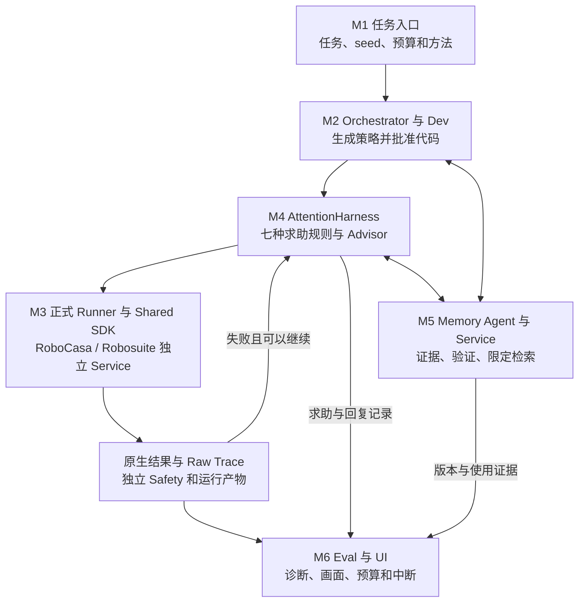

# TidyBot AttentionBench 项目指南

面向 PhD 和协作者的阅读入口。研究问题是：**机器人什么时候值得请求帮助，以及怎样把有效帮助变成可复用经验，在成功率与注意力成本之间取得更好的平衡。**

目前系统功能已接通，有双模拟器开发验证证据；七方法的完整效果比较尚未执行。**本次复核发现最新冻结包与原准入签名不一致，暂不可作为正式执行依据。** 历史记录虽写 `formal_eligible=true`，但当前完整复核失败、`execution_authorized=false`；不能将其理解为有效的当前准入或已有论文效果结论。

## 从哪里看

- [主项目研究分支](https://github.com/TidyBot-Services/Tidybot-Universe/tree/feature/attention-native-robosuite)：代码、协议、UI、测试和验收。**默认 main/master 不一定包含本研究版本。**
- [模块进度](attentionbench_progress.md)与[七策略规格](attentionbench_seven_policy_experiment_spec.md)：完成情况、比较方法与预算。
- [最新冻结包](../benchmarks/attention_harness/protocol/v2/review_packages/seven_primary_guidance_v1_1_dev_2026-10-01/REVIEW.md)与[准入审计](../benchmarks/attention_harness/protocol/v2/admission_audits/guidance_v1_1_entry_rebind_2026-10-01/CONCLUSIONS.md)：策略、配置和判断依据。
- [仓库版本清单](attentionbench_github_delivery.json)与[亲自验证指南](personal_verification_checklist.md)：依赖、复现与停止方法。

## 系统怎样工作



Robosuite 正式路径不依赖 ASPIRE。模拟器负责物理、任务与原生成功判断；TidyBot 负责执行边界、求助决策、Memory、安全记录和证据管理。

## 项目要求与目前进度

1. **在两种仿真环境中重复做实验：已具备工程基础。** 统一执行与记录、50例开发档案已有；最新冻结包的签名一致性需先修正，档案中的失败不能当作策略成功证明。
2. **给执行和求助设统一规则：已接通。** 时间、动作调用、模型 token 与求助 credit 有预算；支持 demo、hint、approval、interrupt。
3. **比较七种求助方法：方法已接入，比较尚未做。** 从不求助、先看演示、失败求助、重试后求助、随机求助、看 Trace 求提示、结合 Trace 与 Memory；计划为两任务、25个开发 seed，共350个运行条件。
4. **根据失败证据决定下一步：已接通。** Raw Trace 投影为 Advisor 可见信息；请求、回复、费用与下一次执行持久关联。GLM 是模型代理，不是真人实验。
5. **把帮助变成可复用经验：已接通并有开发证据。** 原始来源、配对验证、晋升、限定版本检索及失效/禁用/回滚都有链路；两模拟器均有正向开发验证，长期减少求助仍待实验。
6. **看见并控制运行：已接通。** Eval、UI、独立 Safety、中断与回收有工程证据；远程可经 SSH 转发观看。
7. **回答求助是否值得：未完成。** 尚无完整七方法、held-out 或消融结果，不能宣布成功率和成本优势。

当前任务为 Robosuite `cube_lift`、RoboCasa `counter_to_sink`；模拟器采用 `sim_gt`，真实机器人视觉验证另行开展，不混报。单 run 最多4 attempts、120秒/attempt、300秒/run、1 credit、4096 tokens、200 SDK调用。

## 仓库与版本

每项 Service 一个独立仓库。下表是实际研究版本，不是默认分支的最新版；Universe 历史服务副本不替代独立包。

| 仓库 | 内容 | 研究分支与提交 |
| --- | --- | --- |
| [Tidybot-Universe](https://github.com/TidyBot-Services/Tidybot-Universe/tree/feature/attention-native-robosuite) | Harness、SDK、Orchestrator、UI、协议与测试 | `feature/attention-native-robosuite`；本文件所在提交为交付版本 |
| [attention_memory_service](https://github.com/TidyBot-Services/attention_memory_service/tree/feature/attentionbench-week2-sync-20260927) | 记忆状态、验证、授权和生命周期 | `feature/attentionbench-week2-sync-20260927` · `24d4146` |
| [robosuite_sim](https://github.com/TidyBot-Services/robosuite_sim/tree/feature/depth-recovery-engineering-20260930) | 官方 Robosuite、动作回执与深度故障处理 | `feature/depth-recovery-engineering-20260930` · `19fde8a` |
| [maniskill_sim](https://github.com/TidyBot-Services/maniskill_sim/tree/feature/attentionbench-planner-guard-v5) | RoboCasa/ManiSkill 仿真与场景接口 | `feature/attentionbench-planner-guard-v5` · `d3b2fc0` |
| [agent_server](https://github.com/TidyBot-Services/agent_server/tree/feature/attentionbench-planning-rejection-v5) | RoboCasa SDK动作作业、取消与规划拒绝 | `feature/attentionbench-planning-rejection-v5` · `1a4b095` |
| [maniskill-robocasa-tasks](https://github.com/TidyBot-Services/maniskill-robocasa-tasks/tree/feature/attentionbench-week2-sync-20260927) | 任务定义与原生评测 | `feature/attentionbench-week2-sync-20260927` · `b18bbf1` |

## 开始阅读和复现

先阅读进度、规格与版本清单，再获取主项目和 Memory：

```bash
git clone --branch feature/attention-native-robosuite https://github.com/TidyBot-Services/Tidybot-Universe.git
git clone --branch feature/attentionbench-week2-sync-20260927 https://github.com/TidyBot-Services/attention_memory_service.git
git -C attention_memory_service checkout 24d414638ad2cdd6557f09f042e8b6ef2b597b0f
cd Tidybot-Universe
bash benchmarks/attention_harness/setup_env.sh
```

安装入口需要 Linux 与 `uv`，安装 Harness 依赖和锁定的 Robosuite 包，**不等于已配好 RoboCasa CUDA/规划器、模型凭据或所有冻结路径**。用脚本打印的虚拟环境 Python 跑 Harness 回归：

```bash
/path/to/venv/bin/python -m pytest benchmarks/attention_harness/tests -q
```

UI与演示入口见[UI文档](../benchmarks/attention_harness/ui/README.md)和[三项演示脚本](../benchmarks/attention_harness/scripts/README.md)。已配置主机的UI可通过以下隧道观看，浏览器打开 `http://127.0.0.1:8769/ui/`：

```bash
ssh -N -o ExitOnForwardFailure=yes -L 127.0.0.1:8769:127.0.0.1:8769 USER@HOST
```

冻结包含原工作站绝对路径和 Python/源码SHA；新电脑须另建路径身份，不可批量改历史JSON或绕过验证。密钥只通过本地环境注入，不进入GitHub；`parcc/GLM` 是代理别名，不据此断言底层模型版本。

## 结果边界与下一步

- v1.1能把有限规则的指导转成动作参数，不是一般Dev模型自主修复的证明。Robosuite已有开发对照成功改善；RoboCasa指导改变动作但成功未改善，不能混成双方都有效。
- 历史depth 500根因仍未知；新版有动作回执、幂等和受控恢复，此前限定准入裁决认为风险受控，不承诺不再发生。
- 测试回复、历史回放、真实模型与真人帮助分别标记。程序/作者机械审计不等同于外部独立专家复核。
- **先闭合当前冻结包的文档/校验规则与审批SHA关联，再亲自演示，另行授权七方法比较；之后分析成功率、求助成本与安全，最后做Memory/Trace消融和held-out。** 真人、LIBERO、真实机器人独立扩展，Deploy在线发现暂缓。

具体一致性缺口：新语义说明已反映“代码读取指导”，但旧校验规则要求该文件与“不读取”的旧版相同；manifest与批准文件的现SHA也不匹配原总体审计引用。原签名和失败不被改写，详细命令与5项问题见[交付清单](attentionbench_github_delivery.json)。这是现有冻结包的缺陷，不是新增效果门槛。

本次只发布代码、文档与证据，不执行350格、held-out或新模型求助；发布检查见[交付清单](attentionbench_github_delivery.json)。
